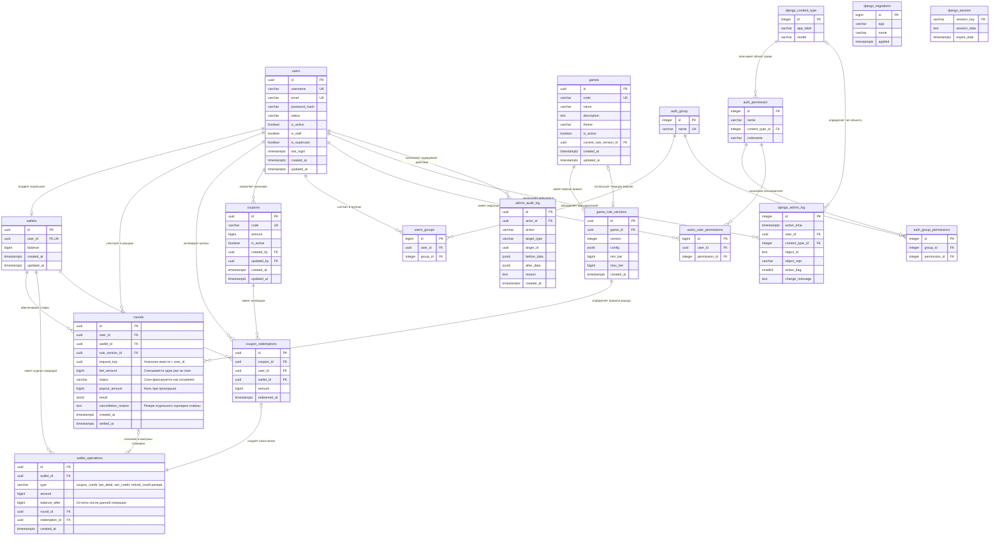

# Код ER-диаграммы

Редакция 07.11.2026. Содержимое блока предназначено для Mermaid Live Editor. Ограничения и транзакционный контракт описаны в design.md.

```mermaid
erDiagram
    %% Редакция 07.11.2026: списание, раунд и выигрыш фиксируются одним COMMIT.
    %% Ошибка откатывает весь спин; refund_credit не используется для ROLLBACK.
    users ||--o| wallets : "владеет кошельком"
    users ||--o{ rounds : "участвует в раундах"
    users ||--o{ coupon_redemptions : "активирует купоны"
    users ||--o{ coupons : "управляет купонами"
    games ||--o{ game_rule_versions : "имеет версии правил"
    games o|--o| game_rule_versions : "использует текущую версию"
    game_rule_versions ||--o{ rounds : "определяет правила раунда"
    wallets ||--o{ rounds : "обеспечивает ставки"
    wallets ||--o{ wallet_operations : "имеет журнал операций"
    wallets ||--o{ coupon_redemptions : "получает начисления по активациям"
    coupons ||--o{ coupon_redemptions : "имеет активации"
    rounds o|--|{ wallet_operations : "списание и выигрыш атомарно"
    coupon_redemptions o|--|| wallet_operations : "создаёт начисление"
    users ||--o{ users_groups : "состоит в группах"
    auth_group ||--o{ users_groups : "объединяет пользователей"
    auth_group ||--o{ auth_group_permissions : "получает права"
    auth_permission ||--o{ auth_group_permissions : "назначено группе"
    users ||--o{ users_user_permissions : "имеет персональные права"
    auth_permission ||--o{ users_user_permissions : "назначено пользователю"
    django_content_type ||--o{ auth_permission : "описывает объект права"
    users ||--o{ django_admin_log : "выполняет действия в админке"
    django_content_type o|--o{ django_admin_log : "определяет тип объекта"
    users ||--o{ admin_audit_log : "выполняет аудируемое действие"

    users {
        uuid id PK
        varchar username UK
        varchar email UK
        varchar password_hash
        varchar status
        boolean is_active
        boolean is_staff
        boolean is_superuser
        timestamptz last_login
        timestamptz created_at
        timestamptz updated_at
    }
    games {
        uuid id PK
        varchar code UK
        varchar name
        text description
        varchar theme
        boolean is_active
        uuid current_rule_version_id FK
        timestamptz created_at
        timestamptz updated_at
    }
    game_rule_versions {
        uuid id PK
        uuid game_id FK
        integer version
        jsonb config
        bigint min_bet
        bigint max_bet
        timestamptz created_at
    }
    wallets {
        uuid id PK
        uuid user_id FK,UK
        bigint balance
        timestamptz created_at
        timestamptz updated_at
    }
    rounds {
        uuid id PK
        uuid user_id FK
        uuid wallet_id FK
        uuid rule_version_id FK
        uuid request_key "Уникален вместе с user_id"
        bigint bet_amount "Списывается один раз за спин"
        varchar status "Спин фиксируется как completed"
        bigint payout_amount "Ноль при проигрыше"
        jsonb result
        text cancellation_reason "Резерв отдельного сценария отмены"
        timestamptz created_at
        timestamptz settled_at
    }
    coupons {
        uuid id PK
        varchar code UK
        bigint amount
        boolean is_active
        uuid created_by FK
        uuid updated_by FK
        timestamptz created_at
        timestamptz updated_at
    }
    coupon_redemptions {
        uuid id PK
        uuid coupon_id FK
        uuid user_id FK
        uuid wallet_id FK
        bigint amount
        timestamptz redeemed_at
    }
    wallet_operations {
        uuid id PK
        uuid wallet_id FK
        varchar type "coupon_credit, bet_debit, win_credit; refund_credit резерв"
        bigint amount
        bigint balance_after "Остаток после данной операции"
        uuid round_id FK
        uuid redemption_id FK
        timestamptz created_at
    }
    django_migrations {
        bigint id PK
        varchar app
        varchar name
        timestamptz applied
    }
    django_session {
        varchar session_key PK
        text session_data
        timestamptz expire_date
    }
    django_content_type {
        integer id PK
        varchar app_label
        varchar model
    }
    auth_permission {
        integer id PK
        varchar name
        integer content_type_id FK
        varchar codename
    }
    auth_group {
        integer id PK
        varchar name UK
    }
    auth_group_permissions {
        integer id PK
        integer group_id FK
        integer permission_id FK
    }
    users_groups {
        bigint id PK
        uuid user_id FK
        integer group_id FK
    }
    users_user_permissions {
        bigint id PK
        uuid user_id FK
        integer permission_id FK
    }
    django_admin_log {
        integer id PK
        timestamptz action_time
        uuid user_id FK
        integer content_type_id FK
        text object_id
        varchar object_repr
        smallint action_flag
        text change_message
    }
    admin_audit_log {
        uuid id PK
        uuid actor_id FK
        varchar action
        varchar target_type
        uuid target_id
        jsonb before_data
        jsonb after_data
        text reason
        timestamptz created_at
    }
```
